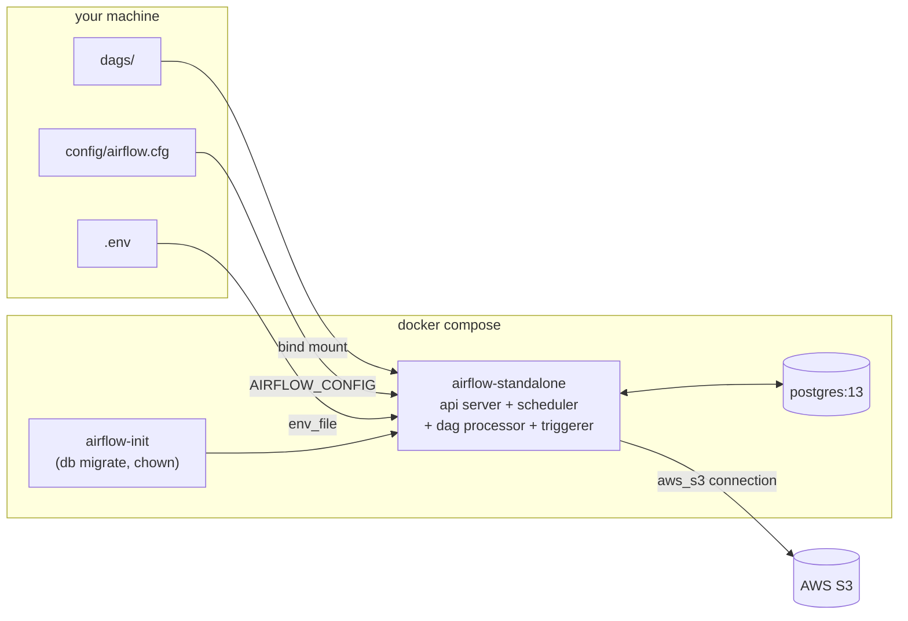

# Airflow Local Setup

A throwaway playground for learning **Apache Airflow 3** on a laptop, with a
focus on one concrete question: *how do you give a DAG credentials to talk to
S3?*

It is deliberately small. One Airflow container, one Postgres container, three
DAG files, and a stripped down version of the official `docker-compose.yaml`.
Nothing here is production shaped.

---

## What is in the box

```
.
├── config/
│   ├── airflow.cfg        # full generated config, mounted into the container
│   └── passwords.json     # SimpleAuthManager password store (admin/admin)
├── dags/
│   ├── simple_dag.py      # Empty -> Bash, the "does it run at all" smoke test
│   ├── dynamic_dag.py     # two DAGs showing dynamic task mapping (.expand)
│   └── s3_file_processing_dag.py  # S3ListOperator + fan out over the keys
├── .env.example           # template for .env (git ignored)
├── docker-compose.yaml    # Airflow 3.0.5 standalone + Postgres 13
├── get_conn_uri.py        # helper: build an AIRFLOW_CONN_* URI for S3
└── pyproject.toml         # uv project, only used for local editor tooling
```

## How the stack fits together



The upstream Airflow compose file ships a full CeleryExecutor cluster (Redis,
separate api-server, scheduler, dag-processor, worker, triggerer, Flower). All
of that is commented out here in favour of a single `airflow standalone`
service, which runs every component in one container. Postgres is kept because
it is the only piece the standalone process does not fake convincingly.

Two more deliberate choices:

- **Configuration lives in `config/airflow.cfg`**, pointed at by
  `AIRFLOW_CONFIG=/opt/airflow/config/airflow.cfg`. That is why the big block of
  `AIRFLOW__CORE__*` environment variables in the compose file is commented out.
  Editing the file is the way to change settings, not the env block.
- **`LocalExecutor`**, `load_examples = False`, and
  `dags_are_paused_at_creation = True` are all set in that config file.

Auth is Airflow 3's `SimpleAuthManager`: the user list comes from
`simple_auth_manager_users = admin:admin` in `airflow.cfg` and the password from
`config/passwords.json`. Standalone would normally print a random generated
password on first boot; pinning the file keeps the login stable across
`docker compose down -v`.

---

## Requirements

- Docker with Compose v2, at least 4 GB of memory given to it
- An AWS access key pair with `s3:ListBucket` on whatever bucket you point at,
  if you want the S3 DAG to do anything
- Optional: [uv](https://docs.astral.sh/uv/) and Python 3.13 for local tooling

## Quick start

**1. Create the env file.**

```bash
cp .env.example .env
id -u   # put this value in AIRFLOW_UID
```

It has to live in the repo root under exactly that name. Compose reads a root
level `.env` twice: once to expand `${...}` placeholders inside
`docker-compose.yaml`, and once as the declared `env_file` that is handed to the
containers. A file anywhere else only does the second job, which means
`${AIRFLOW_UID}` silently falls back to uid 50000 and the container writes files
your host user cannot delete.

**2. Build the S3 connection URI.**

Airflow reads connections from `AIRFLOW_CONN_<CONN_ID uppercased>` environment
variables, and the value is a URI whose user/password parts must be URL
encoded (AWS secret keys routinely contain `/` and `+`). `get_conn_uri.py`
does the encoding for you:

```bash
uv run get_conn_uri.py   # after editing the placeholders in the file
# aws://AKIA...:kMi%2Fabc...@
```

Paste the result into `.env`:

```dotenv
AIRFLOW_UID=1000
AIRFLOW_CONN_AWS_S3='aws://AKIA...:kMi%2Fabc...@'
```

**3. Start it.**

```bash
docker compose up -d
docker compose logs -f airflow-standalone
```

**4. Open <http://localhost:8080>** and log in with `admin` / `admin`.

New DAGs arrive paused. Unpause one, then hit the play button to trigger a run
(every DAG here has `schedule=None`, so nothing runs on its own).

**5. Tear down.**

```bash
docker compose down          # keep the metadata database
docker compose down -v       # also drop the postgres volume, full reset
```

---

## The S3 connection

The point of the exercise. There are three ways to hand Airflow a connection,
and this repo uses the third:

| Approach | How | Trade-off |
| --- | --- | --- |
| UI / CLI | Admin > Connections, or `airflow connections add` | Stored in the metadata DB, lost on `down -v`, not in version control |
| Secrets backend | `[secrets] backend = ...SystemsManagerParameterStoreBackend` | The real answer for production, needs cloud setup |
| Env var | `AIRFLOW_CONN_AWS_S3='aws://key:secret@'` | Zero infrastructure, reproducible, and the secret never touches the DB |

Anatomy of the URI:

```
aws://<url-encoded access key id>:<url-encoded secret access key>@
 ^          ^                              ^                     ^
 |          login                          password              empty host
 conn_type
```

The trailing `@` matters: it terminates the credentials section of an otherwise
hostless URI. Extra settings (region, role ARN, endpoint) go in a
`?__extra__=<url-encoded json>` query string, which is exactly why generating
the URI with `Connection.get_uri()` beats hand assembling it.

`dags/s3_file_processing_dag.py` then just refers to it by id:

```python
S3ListOperator(task_id="list_s3_files", bucket=S3_BUCKET, aws_conn_id="aws_s3")
```

The `aws` connection type comes from the `apache-airflow-providers-amazon`
package, which is preinstalled in the `apache/airflow` image and pulled locally
through the `apache-airflow[amazon]` extra in `pyproject.toml`.

## The DAGs

| File | DAG id | What it teaches |
| --- | --- | --- |
| `simple_dag.py` | `simple_dag` | Classic operators and `>>` dependencies. `EmptyOperator` into a `BashOperator`. Use it to confirm the scheduler and executor work before blaming AWS. |
| `dynamic_dag.py` | `example_dynamic_task_mapping`, `example_task_mapping_second_order` | Upstream's dynamic task mapping examples, vendored so they show up with `load_examples = False`. One maps over a literal list, the other maps over the output of another mapped task. |
| `s3_file_processing_dag.py` | `s3_file_processing_dag` | The interesting one. `S3ListOperator` lists a bucket, its `.output` XCom feeds a TaskFlow task, and `parse_file.expand(...)` creates one task instance per object key at run time. |

Change `S3_BUCKET` at the top of `s3_file_processing_dag.py` to a bucket your
key can actually read.

## Local Python environment

The `pyproject.toml` / `uv.lock` pair is *not* what runs your DAGs. The
container image supplies Airflow. The local environment exists so your editor
can resolve `airflow.sdk` imports and so `get_conn_uri.py` can run on the host:

```bash
uv sync
uv run get_conn_uri.py
```

## Useful commands

```bash
# any Airflow CLI command inside the running container
docker compose exec airflow-standalone airflow version
docker compose exec airflow-standalone airflow dags list
docker compose exec airflow-standalone airflow connections get aws_s3

# parse a DAG file without scheduling anything
docker compose exec airflow-standalone airflow dags list-import-errors

# see the effective config (which airflow.cfg values actually won)
docker compose exec airflow-standalone airflow config list

# verify how compose resolved the file before starting anything
docker compose config
```

Task logs land in `logs/` on the host through the bind mount.

---

## Not for production

Single container, `LocalExecutor`, no Redis or Celery workers, no secrets
backend, no TLS, hardcoded keys, `admin`/`admin`. It is a sandbox for reading
logs and breaking things.
